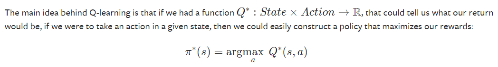
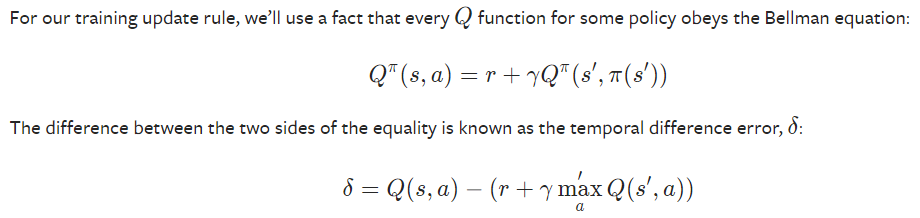
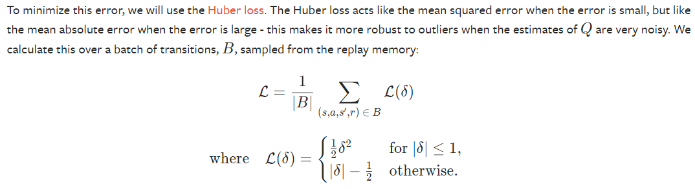

# Overview

DQN works by using a Neural Network (NN) as a function approximator. Where the function is trying to determine the action which gives the highest reward given the current observed state.

Note: π*(s) picks the action with maximum reward given a state.
As we do not have access to Q* we train a neural network to resemble Q*.

Note: Qπ(s,a) is the idealistic Q function. If we had all the information about possible (state, action) pairs then the reward for a given (state, action) would be equalivalent to the reward + the discounted reward of the next (state, ***best_action***). This provides us with an error function that can be used to adjust NN parameters.

# Keywords
**Episode**: a single simulation of the environment

**Tensor**: a n-dimension array/matrix which can be used for GPU processing

# Replay Memory

Replay memory is a deque (***double-ended queue***) used to train the DQN, it stores the (state, action) transitions from state x to state y. It is a cyclic buffer with a bounded size that holds the transitions observed recently. It also implements sample method for selecting a random batch of transitions for training.

# Training

For a given number of episodes repeat
1. select action (either random or policy depending on the threshold)
2. step the environment
3. store the transition in the memory
4. update current state
5. optimize the model
6. soft update the target network's weights

# Optimization
For each step of optimization the procedure follows:
1. sample from memory of transitions a given BATCH_SIZE
2. create a mask of states with non-final-next-states & get the non final states
3. split batch into 3 arrays: state_batch, action_batch and reward_batch
4. Compute Q(s,a) for all states sampled.
    - run the state_batch through the NN and select the columns of actions taken (actions for each state according to the net).
5. Compute V(st+1), aka expected maximum reward for all next states. This is stored in ***next_state_values***
    - This is calculated based on the older target network. ***(next_state_values * GAMMA) + reward_batch***, where reward_batch is the current states reward.
6. Compute the loss via Huber Loss applied to the ***temporal difference error***
    - The temporal difference (input to loss function) is calculated as the reward for current state_action pairs minus the expected reward for the next_state_action pairs. This is minimised to make the models current reward function converge with the expected reward.
7. Optimize the model.

# Hyperparameters
- BATCH_SIZE: number of transitions sampled from memory
- GAMMA: discount factor for the Bellman's equation
- EPS_START: starting value for epsilon (used for probability of random vs policy action)
- EPS_END: the final value of epsilon
- EPS_DECAY: the rate of exponential decay (higher means slower)
- TAU: is the update rate of the target network
- LR: is the learning rate of the AdamW optimizer
